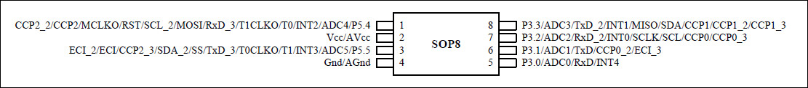

# 模型灯效入门代码

## 芯片选择

灯效控制芯片选用STC8G系列，SOP8封装，引脚如下图所示：

p.s. STC8G1K08A-8PIN系列和STC8G1K08-8PIN系列，每个I/O口在弱上拉（准双向口）/强推挽输出/开漏模式时都能承受20mA的灌电流，整个芯片的工作电流推荐不要超过35mA，即从Vcc流入的电流建议不要超过35mA，从Gnd流出电流建议不要超过35mA，整体流入/流出
电流建议都不要超过35mA。在设计电路时要注意选择合适的限流电阻。

## 烧录注意事项

USB串口烧录单片机程序的接线方式如下表所示：

| 下载器 | 单片机 |
| :-----| :---- |
| Vcc | Vcc |
| GND | GND |
| TXD | RXD |
| RXD | TXD |

## 示例代码

### 01. demo_led

闪烁灯效的实现；

### 02. general_led

闪烁灯效与呼吸灯的同时实现；

### 03. generalControl_led

闪烁灯效与呼吸灯的同时实现；
通过按键触发外部中断，可以实现五种灯效模式的切换；

### 04. generalJet_led

喷口灯效实现，快速闪烁三次，慢速闪烁一次，循环执行；

## 05. generalJet_twoColorLed

双色LED喷口灯效实现，LED以颜色1快速闪烁三次，以颜色2慢速闪烁一次，循环执行；

## 06. Jegan

hg杰刚的灯效实现；

## 待办

- [ ] 更新项目相关电路图；

- [ ] 更新效果图；