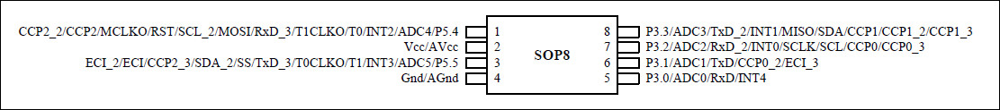

# 模型灯效入门代码

## 芯片选择

灯效控制芯片选用STC8G系列，SOP8封装，引脚如下图所示：

p.s. STC8G1K08A-8PIN系列和STC8G1K08-8PIN系列，整个芯片的工作电流推荐不要超过35mA，即从Vcc流入的电流建议不要超过35mA，从Gnd流出电流建议不要超过35mA，整体流入/流出
电流建议都不要超过35mA。在设计电路时要注意选择合适的限流电阻。

## 示例代码

### 01. demo_led

闪烁灯效的实现；

### 02. general_led

闪烁灯效与呼吸灯的同时实现；

### 03. generalControl_led

闪烁灯效与呼吸灯的同时实现；
通过按键触发外部中断，可以实现五种灯效模式的切换；